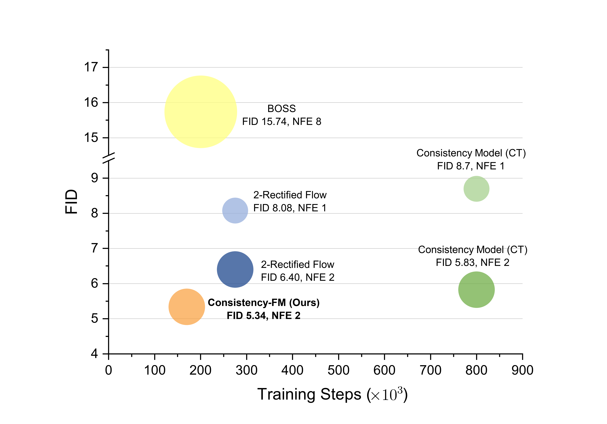
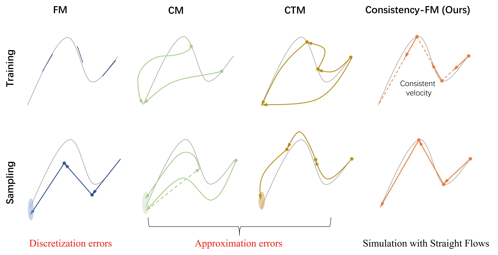

# Consistency Flow Matching: Defining Straight Flows with Velocity Consistency

This repository contains the official implementation of our [Consistency Flow Matching](./github_misc/Consistency_FM_arxiv.pdf).

> [**Consistency Flow Matching: Defining Straight Flows with Velocity Consistency**](./github_misc/Consistency_FM_arxiv.pdf)   
> [Ling Yang](https://yangling0818.github.io/), 
> [Zixiang Zhang](),
> [Zhilong Zhang](),
> [Xingchao Liu](https://gnobitab.github.io/),
> [Minkai Xu](https://minkaixu.com/),
> [Wentao Zhang](https://zwt233.github.io/),
> [Chenlin Meng](https://cs.stanford.edu/~chenlin/),
> [Stefano Ermon](https://cs.stanford.edu/~ermon/), 
> [Bin Cui](https://cuibinpku.github.io/) 
> <br>**Peking University, University of Texas at Austin, Stanford University, Pika Labs**<br>

## Introduction



Flow matching (FM) is a general framework for defining probability paths via Ordinary Differential Equations (ODEs) to transform between noise and data samples. Recent approaches attempt to straighten these flow trajectories to generate high-quality samples with fewer function evaluations, typically through iterative rectification methods or optimal transport solutions. In this paper, we introduce Consistency Flow Matching (Consistency-FM), a novel FM method that explicitly enforces self-consistency in the velocity field. Consistency-FM directly defines straight flows starting from different times to the same endpoint, imposing constraints on their velocity values. Additionally, we propose a multi-segment training approach for Consistency-FM to enhance expressiveness, achieving a better trade-off between sampling quality and speed. Experiments demonstrate that our Consistency-FM significantly improves training efficiency by converging 4.4x faster than consistency models and 1.7x faster than rectified flow models while achieving better generation quality



## Image Generation

### Dependencies
<!-- The following instructions have been tested on 8A100 40GB PCIe GPUs and Ubuntu 22.04.3 (Driver Version: 535.161.07, CUDA Version: 11.8, CuDNN Version: 8.9.7). -->

Run the following commands to install the dependencies:
```bash
conda create -n cfm python=3.8
conda activate cfm
pip install torch==1.11.0+cu113 torchvision==0.12.0+cu113 --extra-index-url https://download.pytorch.org/whl/cu113
pip install tensorflow==2.9.0 tensorflow-probability==0.12.2 tensorflow-gan==2.0.0 tensorflow-datasets==4.6.0
pip install -U jax==0.3.4 jaxlib==0.3.2+cuda11.cudnn82 -f https://storage.googleapis.com/jax-releases/jax_cuda_releases.html
pip install -r requirements.txt
```

### CIFAR-10

#### Training

Run the following command to train a Consistency-FM Flow from scratch

```bash
python ./main.py --config ./configs/consistencyfm/cifar10_gaussian_ddpmpp.py --eval_folder eval --mode train --workdir ./logs/cifar10 --config.consistencyfm.boundary 0 --config.training.n_iters 100001
# After the above training process completes, run the command below to continue.
python ./main.py --config ./configs/consistencyfm/cifar10_gaussian_ddpmpp.py --eval_folder eval --mode train --workdir ./logs/cifar10 --config.consistencyfm.boundary 0.9 --config.training.n_iters 200001
```

* ```--config``` The configuration file for this run.

* ```--eval_folder``` The generated images and other files for each evaluation during training will be stroed in ```./workdir/eval_folder```. In this command, it is ```./logs/cifar10/eval/```

* ```--mode``` Mode selection for ```main.py```. Select from ```train```or ```eval``` .

#### Sampling and Evaluation

We follow the evaluation pipeline as in [Score SDE](https://github.com/yang-song/score_sde_pytorch). You can download [`cifar10_stats.npz`](https://drive.google.com/file/d/14UB27-Spi8VjZYKST3ZcT8YVhAluiFWI/view?usp=sharing) and save it to `assets/stats/`. 
Then run

```bash
python ./main.py --config ./configs/consistencyfm/cifar10_gaussian_ddpmpp.py --eval_folder eval/NFE=2 --mode eval --config.eval.enable_sampling  --config.eval.batch_size 1024 --config.eval.num_samples 50000 --config.sampling.sample_N 2 \
    --config.eval.begin_ckpt 34 \
    --config.eval.end_ckpt 40 \
    --workdir ./logs/cifar10
```

which uses a batch size of 1024 to sample 50000 images, starting from checkpoint-34.pth, and computes the FID and IS.

For a quick start, we have provided CIFAR-10 checkpoints at [this link](https://drive.google.com/file/d/1KlHPe2RYg75Zq4BKb0k1GQMWsNhrjLzb/view?usp=sharing).

### High-Resolution Datasets 

To train Consistency-FM on [CelebA-HQ (256x256)](https://github.com/clovaai/stargan-v2-tensorflow/tree/master), follow these steps:
```bash
python ./main.py --config ./configs/consistencyfm/celeba_hq_pytorch_gaussian.py --eval_folder eval --mode train --workdir ./logs/celebahq --config.consistencyfm.boundary 0 --config.training.n_iters 150001 --config.training.data_dir path_to_celebahq
# After the above training process completes, run the command below to continue.
python ./main.py --config ./configs/consistencyfm/celeba_hq_pytorch_gaussian.py --eval_folder eval --mode train --workdir ./logs/celebahq --config.consistencyfm.boundary 0.9 --config.training.n_iters 250001 --config.training.data_dir path_to_celebahq
```

To sample images, run:
```bash
python ./main.py --config ./configs/consistencyfm/celeba_hq_pytorch_gaussian.py --mode eval --config.eval.enable_figures_only \
    --config.training.data_dir path_to_celebahq \
    --config.eval.num_samples 200 \
    --config.eval.batch_size 25 \
    --eval_folder fig_only/NFE=6 --config.sampling.sample_N 6 \
    --workdir ./logs/celebahq \
    --config.eval.begin_ckpt 0 --config.eval.end_ckpt 100
```

To evaluate the model, follow the instructions in [On Aliased Resizing and Surprising Subtleties in GAN Evaluation](https://github.com/GaParmar/clean-fid/tree/main) to generate the custom stats files, and then use the command below to calculate the FID score:

```bash
python ./main.py --config ./configs/consistencyfm/celeba_hq_pytorch_gaussian.py --mode eval --config.eval.enable_sampling --config.eval.end_ckpt 100 --config.eval.clean_fid.enabled True \
    --config.training.data_dir path_to_celebahq \
    --config.eval.num_samples 50000 \
    --config.eval.batch_size 100 \
    --workdir ./logs/celebahq \
    --eval_folder eval_cleanfid/samples=10K/NFE=6 \
    --config.eval.begin_ckpt 51 \
    --config.sampling.sample_N 6 \
    --config.eval.clean_fid.custom_stat.dataset_name1 custom_cleanfid_stats_name
```

For [AFHQ-CAT](https://github.com/clovaai/stargan-v2-tensorflow/tree/master), simply replace `./configs/consistencyfm/celeba_hq_pytorch_gaussian.py` with `./configs/consistencyfm/afhq_cat_pytorch_gaussian.py`.

## Citation
If you use the code or our work is related to yours, please cite us:
```
@article{yang2024consistencyfm,
  title={Consistency Flow Matching: Defining Straight Flows with Velocity Consistency},
  author={Yang, Ling and Zhang, Zixiang and Zhang, Zhilong and Liu, Xingchao and Xu, Minkai and Zhang, Wentao and Meng, Chenlin and Ermon, Stefano and Cui, Bin},
  journal={arXiv preprint arXiv:2407.02398},
  year={2024}
}
```

## Acknowledgements

Thanks to [RectifiedFlow](https://github.com/gnobitab/RectifiedFlow) and [TorchCFM](https://github.com/atong01/conditional-flow-matching) for providing their implementations, which have significantly contributed to this codebase.
